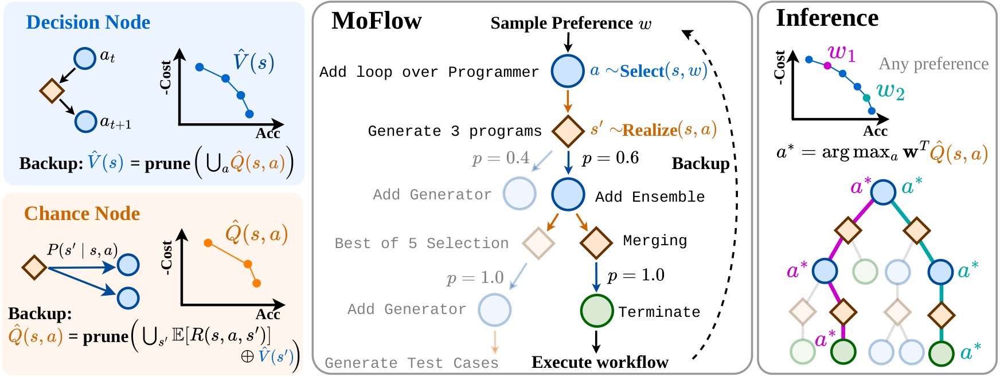
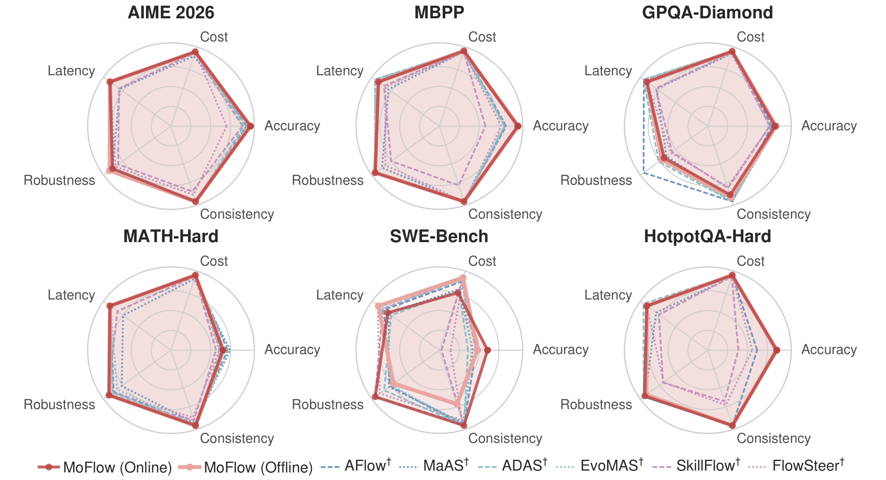

<div align="center">

# MoFlow: Multi-Objective Agentic Workflow Generation

**Yining Lu**<sup>1\*</sup>, **Aurelie Lozano**<sup>2</sup>, **Xi Yang**<sup>2</sup>, **Naoki Abe**<sup>2</sup>, **Yu Deng**<sup>2</sup>, **Meng Jiang**<sup>1</sup>

<sup>1</sup>University of Notre Dame &nbsp;&nbsp; <sup>2</sup>IBM

<sub>\*Work done during an internship at IBM.</sub>

</div>

MoFlow generates agentic workflows that trade off five objectives: accuracy, cost, latency, robustness, and consistency. It casts workflow generation as a multi-objective MDP and solves it with Convex-Hull Monte Carlo Tree Search, where every node stores the set of trade-offs reachable from it instead of a single score. One search therefore covers the Pareto front, and afterwards serves a workflow for any preference by lookup, with no retraining and no extra LLM calls.

<p align="center">
  
</p>

## Results

Across six benchmarks, MoFlow achieves the best average hypervolume against six workflow generators, even though each baseline is rerun for every testing preference while MoFlow serves all of them from a single search.

<p align="center">
  
</p>

## Installation

```bash
git clone https://github.com/yining610/MoFlow.git
cd MoFlow
conda create -n moflow python=3.12 -y && conda activate moflow
pip install -r requirements.txt
```

The frozen splits of all six benchmarks ship in `data/`.

## LLM endpoint

MoFlow works with any OpenAI-compatible endpoint. We used a [LiteLLM](https://github.com/BerriAI/litellm) proxy, e.g. for GPT-5 Mini:

```yaml
# litellm_config.yaml
model_list:
  - model_name: gpt-5-mini
    litellm_params:
      model: openai/gpt-5-mini-2025-08-07
      api_key: os.environ/OPENAI_API_KEY
litellm_settings:
  drop_params: true
```

```bash
pip install 'litellm[proxy]'
export OPENAI_API_KEY=<your-key>
litellm --config litellm_config.yaml --port 4000
```

The scripts use `BASE_URL` (default `http://localhost:4000`), `API_KEY_ENV` (default `OPENAI_API_KEY`), and `MODEL`; override any of them from the environment.

## Quickstart

Run a small search on AIME 2026 (5 trials), which also scores the workflows served for the eleven testing preferences on the held-out split:

```bash
python -m moo_mcts.cli build-task --task aime --model gpt-5-mini --predictor gnn \
    --trials 5 --paraphrases 3 --samples 3 \
    --save --out-dir results/quickstart --bundle results/quickstart/gnn_bundle.pkl
```

Serve any preference from the saved tree (lookup only, no LLM calls) and compute the held-out hypervolume:

```bash
python -m moo_mcts.cli inference --tree results/quickstart/aime_2026_task_tree.json \
    --w 1,0,0,0,0 0.2,0.2,0.2,0.2,0.2 --emit yaml
python scripts/eval_hypervolume.py results/quickstart/points.csv
```

## Reproducing the paper

An online search executes every workflow it generates and used 116–597M tokens per benchmark in our runs, so start with the quickstart.

```bash
# MoFlow (online)
bash scripts/aime/run_aime_czt_gpt5-mini.sh
bash scripts/math/run_math_czt.sh
bash scripts/mbpp/run_mbpp_czt.sh
bash scripts/gpqa/run_gpqa_czt.sh
bash scripts/hotpotqa/run_hotpotqa_czt.sh
bash scripts/swe/run_swe_czt.sh

# MoFlow (offline): train the GNN on the online runs, then search without execution
bash scripts/gnn/collect_data.sh
bash scripts/gnn/train_gnn.sh
for task in aime math mbpp gpqa hotpotqa swe; do bash scripts/gnn/build_tree_offline.sh $task; done

# Other base models
bash scripts/aime/run_aime_czt_haiku.sh
bash scripts/aime/run_aime_czt_gemini.sh
bash scripts/aime/run_aime_czt_deepseek.sh

# Action-selection ablation
for sel in czt pareto hypervolume chebyshev; do bash scripts/aime/run_aime_selector_ablation.sh $sel; done

# Query-level search
bash scripts/aime/run_aime_query_gpt5-mini.sh
bash scripts/merge_query_shards.sh results/aime_2026/gpt-5-mini/per_query/czt

# Hypervolume of the served workflows
python scripts/eval_hypervolume.py results/*/gpt-5-mini/per_task/czt/points.csv
```

Results are written to `results/<task>/<model>/`, and re-running a script resumes from its checkpoint.

SWE-bench patches are graded by a local server that needs Docker and about 200 GB of disk; start it before the SWE runs:

```bash
pip install "swebench>=4.1,<5" flask docker
bash scripts/swe/start_swe_server.sh
```

See [`tasks/swe_server/README.md`](tasks/swe_server/README.md) for details.

## Repository structure

```text
moo_mcts/   the algorithm: workflow graph, search, value model, serving (python -m moo_mcts.cli)
tasks/      benchmark definitions, graders, and the SWE-bench grading server
scripts/    run scripts for every experiment, plus eval_hypervolume.py
data/       frozen benchmark splits with paraphrases
```

## Citation

```bibtex
```
